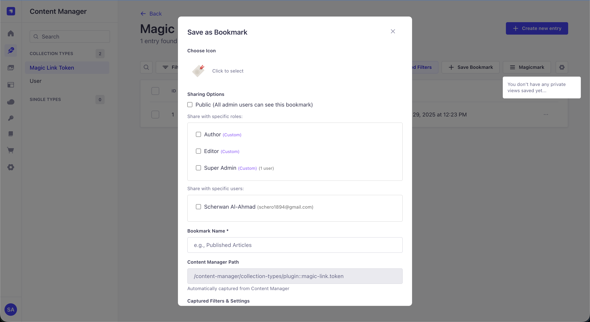
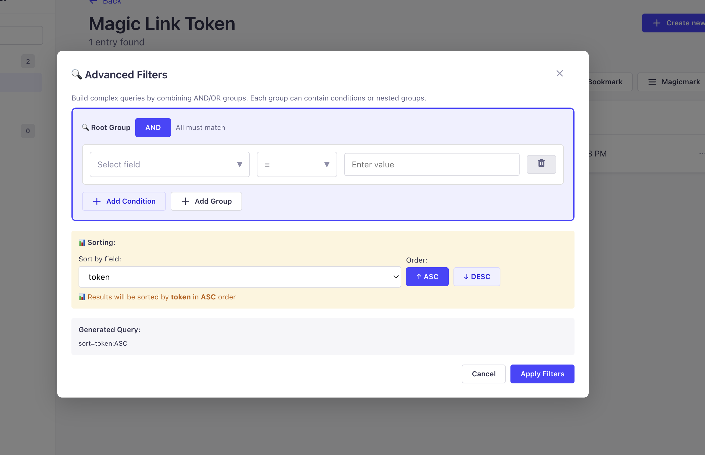
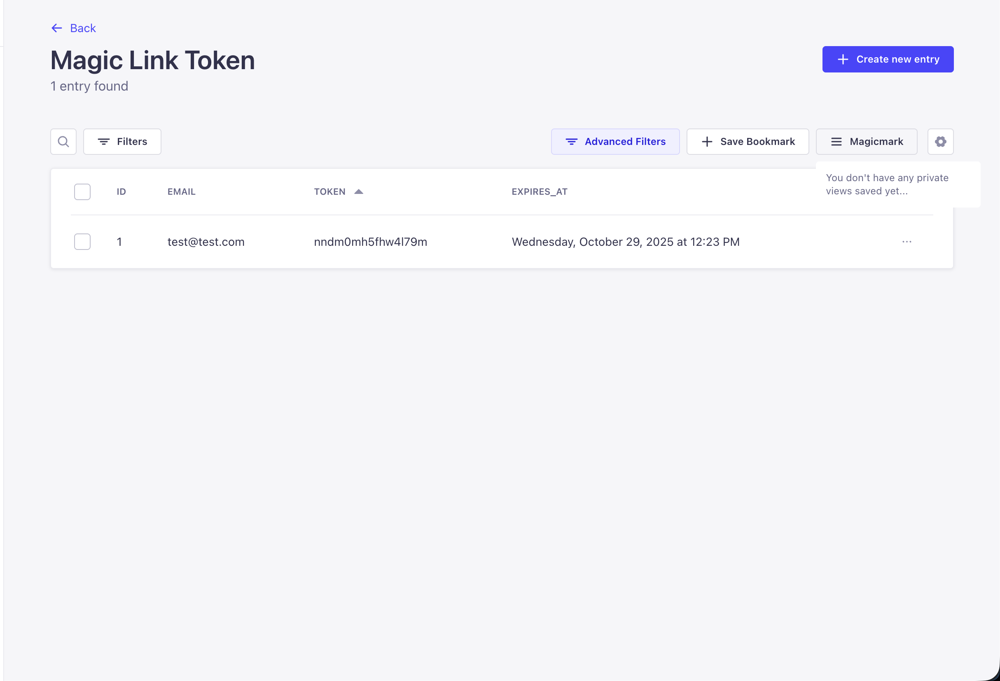

# MagicMark - Advanced Query Builder for Strapi v5 🔖

**Save and apply complex Content Manager queries with one click.** Professional bookmark management with role-based sharing, advanced filtering, and drag-and-drop organization for Strapi v5.

[](LICENSE)
[](https://www.npmjs.com/package/strapi-plugin-magic-mark)
[](https://github.com/Schero94/Magicmark/releases)

---

## 📸 Screenshots

### MagicMark Dashboard
Professional interface for managing query bookmarks with statistics and easy access.


### Save as MagicMark
Create bookmarks with emoji, name, description, and sharing options directly from Content Manager.



### Advanced Filter Builder
Build complex queries with the advanced filter modal for precise content filtering.



### Quick Access in Content Manager
Seamless integration - MagicMark button right in the Content Manager toolbar for instant bookmark access.



---

## 📋 Table of Contents

- [Features](#features)
- [Quick Start](#quick-start)
- [How It Works](#how-it-works)
- [Screenshots in Action](#screenshots-in-action)
- [API Routes](#api-routes)
- [Configuration](#configuration)
- [Use Cases](#use-cases)
- [Testing](#testing)
- [Troubleshooting](#troubleshooting)
- [Development](#development)

---

## ✨ Features

### Core Bookmark Management
✅ **Query Bookmarks** - Save complex Content Manager filters, sorts, and pagination  
✅ **One-Click Apply** - Instantly restore entire query states  
✅ **Emoji Identification** - Visual icons for quick bookmark recognition  
✅ **Pin to Top** - Keep frequently used bookmarks always accessible  
✅ **Drag & Drop** - Reorder bookmarks effortlessly  
✅ **Mobile Optimized** - Fully responsive design  

### Advanced Sharing
✅ **Role-Based Sharing** - Share with specific admin roles  
✅ **User Sharing** - Share with individual admin users  
✅ **Public Bookmarks** - Make bookmarks visible to all users  
✅ **Permission Control** - Fine-grained access management  

### User Experience
✅ **Quick Access** - Bookmark button in Content Manager toolbar  
✅ **Filter Preview** - See exactly what's saved in each bookmark  
✅ **Descriptions** - Add notes to remember bookmark purpose  
✅ **Context Aware** - Automatically detects current content type  
✅ **Instant Save** - Capture current query state in one click  
✅ **Professional UI** - Beautiful gradient design with smooth animations  

### Multi-Language Support
✅ **5 Languages** - English, Deutsch, Français, Español, Português  
✅ **Auto-Detection** - Follows your Strapi admin language  
✅ **Complete i18n** - All UI elements translated  

---

## 🚀 Quick Start

### 1. Install Plugin

```bash
npm install strapi-plugin-magic-mark
# or
yarn add strapi-plugin-magic-mark
```

### 2. Register in Config

Add to `src/config/plugins.ts` (or `plugins.js`):

```typescript
export default () => ({
  'magic-mark': {
    enabled: true,
  },
});
```

### 3. Build & Run

```bash
# Rebuild admin panel
npm run build

# Start Strapi
npm run develop
```

### 4. Activate License (First Use)

- Go to Admin → **MagicMark**
- Click **"Activate License"**
- Choose: Auto-create, Manual entry, or Existing key
- Done! Plugin is ready

### 5. Save Your First Bookmark

1. Navigate to any Content Manager collection
2. Apply filters, sorting, or search
3. Click the **MagicMark** button in the toolbar (see screenshot above)
4. Click **"Save Bookmark"**
5. Add:
   - Name (e.g., "Published Articles")
   - Emoji (e.g., 📰)
   - Description (optional)
   - Sharing settings (optional)
6. Click **Save**

### 6. Use Bookmarks

- Click **MagicMark** → Select bookmark → Done!
- All filters are instantly applied
- Share with team members

---

## 🔄 How It Works

### Bookmark Save Flow

```
User in Content Manager
       ↓
Applies: Filters, Sort, Search, Pagination
       ↓
[Click MagicMark Button] (See "Quick Access" screenshot)
       ↓
"Save Bookmark" Modal opens (See "Save as MagicMark" screenshot)
       ↓
User enters: Name, Emoji, Description, Sharing
       ↓
[Save]
       ↓
Query parameters captured:
  - Path: /content-manager/collection-types/api::article.article
  - Query: filters[$and][0][publishedAt][$notNull]=true&sort[0]=createdAt:desc
  - Pagination: page=1&pageSize=25
       ↓
Bookmark stored in database
       ↓
Success! Bookmark appears in Dashboard (See "Dashboard" screenshot)
```

### Bookmark Apply Flow

```
User clicks MagicMark button
       ↓
List of available bookmarks appears
  (filtered by user permissions)
       ↓
[User selects bookmark]
       ↓
Navigation to content type happens
       ↓
Query parameters applied:
  - Filters restored (See "Advanced Filters" screenshot)
  - Sort order set
  - Pagination reset
  - Search cleared
       ↓
Content Manager displays filtered results
```

---

## 🎬 Screenshots in Action

### 1. Dashboard View
The main **MagicMark Dashboard** (see first screenshot above) shows:
- All your bookmarks with emoji icons
- Pinned bookmarks at the top
- Quick actions: Edit, Delete, Share
- Search and filter capabilities
- Beautiful gradient design

### 2. Quick Access Button
The **Quick Access** button (see screenshot above) is integrated directly into:
- Content Manager toolbar
- Appears on all collection pages
- One-click access to bookmarks
- Context-aware (shows relevant bookmarks)

### 3. Save Bookmark Modal
The **Save Bookmark Modal** (see screenshot above) includes:
- Name field with emoji picker
- Description for notes
- Sharing options (Roles, Users, Public)
- Preview of current query
- Visual feedback

### 4. Advanced Filters
The **Advanced Filter Builder** (see screenshot above) lets you:
- Build complex filter conditions
- Combine AND/OR logic
- Save multi-level queries
- Preview filter results
- Edit existing filters

---

## 📡 API Routes

### Content API Routes

All routes require valid JWT authentication (except public bookmarks).

#### Get All Bookmarks

```bash
GET /api/magic-mark/bookmarks

Response:
{
  "data": [
    {
      "id": 1,
      "attributes": {
        "name": "Published Articles",
        "emoji": "📰",
        "description": "Recent published content",
        "path": "/content-manager/collection-types/api::article.article",
        "query": "filters[$and][0][publishedAt][$notNull]=true",
        "isPinned": true,
        "isPublic": false,
        "createdAt": "2024-01-15T10:30:00Z"
      }
    }
  ],
  "meta": { "count": 5 }
}
```

#### Create Bookmark

```bash
POST /api/magic-mark/bookmarks
Authorization: Bearer JWT_TOKEN

Request:
{
  "data": {
    "name": "Draft Posts",
    "emoji": "📝",
    "description": "Unpublished drafts",
    "path": "/content-manager/collection-types/api::article.article",
    "query": "filters[0][publishedAt][$null]=true",
    "isPublic": false,
    "sharedWithRoles": [1, 2],
    "sharedWithUsers": [3]
  }
}
```

#### Update Bookmark

```bash
PUT /api/magic-mark/bookmarks/:id
Authorization: Bearer JWT_TOKEN
```

#### Delete Bookmark

```bash
DELETE /api/magic-mark/bookmarks/:id
Authorization: Bearer JWT_TOKEN
```

#### Reorder Bookmarks

```bash
POST /api/magic-mark/bookmarks/reorder
Authorization: Bearer JWT_TOKEN

Request:
{
  "bookmarkIds": [3, 1, 5, 2, 4]
}
```

---

## ⚙️ Configuration

### Basic Setup (Default)

The plugin works out of the box with zero configuration!

```typescript
// src/config/plugins.ts
export default () => ({
  'magic-mark': {
    enabled: true,
  },
});
```

### Advanced Options (Optional)

```typescript
export default () => ({
  'magic-mark': {
    enabled: true,
    config: {
      // Maximum bookmarks per user
      maxBookmarksPerUser: 50,
      
      // Enable query history
      enableHistory: true,
      
      // Auto-cleanup old queries (days)
      autoCleanupDays: 90,
    },
  },
});
```

---

## 💡 Use Cases

### Content Management

**Published Articles** 📰
```
Filter: publishedAt is not empty
Sort: createdAt DESC
Result: Quick access to all published content
```

**Draft Posts** 📝
```
Filter: publishedAt is empty AND status = "draft"
Sort: updatedAt DESC
Result: Focus on work in progress
```

**Recent Updates** 🕒
```
Filter: updatedAt >= 7 days ago
Sort: updatedAt DESC
Result: See what changed recently
```

**My Content** 👤
```
Filter: createdBy = current user
Sort: createdAt DESC
Result: See all your creations
```

### Team Collaboration

**Shared Queries** 👥
- Team members access same filtered views
- No need to re-apply complex filters
- Everyone sees consistent data

**Role-Based Access** 🔐
- Editors see different bookmarks than Authors
- Managers see different views than Contributors
- Automatic based on admin roles

**Public Bookmarks** 🌍
- Common queries for entire team
- New members immediately see them
- Save time explaining filters

### Power Users

**Complex Filters** 🎯
```
Save multi-condition queries:
  - Status = "approved"
  - Category IN ["tech", "news"]
  - Priority >= "high"
  - CreatedAt >= "2024-01-01"
```

**Sorted Views** 📊
```
Different sort orders for different needs:
  - By date (newest first)
  - By title (A-Z)
  - By popularity (most viewed)
```

---

## 🧪 Testing

### 1. Install & Setup

```bash
# Install in your Strapi project
npm install strapi-plugin-magic-mark

# Add to config/plugins.ts
# Rebuild admin
npm run build
```

### 2. Test Basic Bookmark

1. Go to Content Manager → Any collection
2. Apply some filters
3. Click **MagicMark** button (see screenshot)
4. Save with name "Test Bookmark" and emoji 🧪
5. Verify it appears in dashboard

### 3. Test Bookmark Apply

1. Clear all filters
2. Click **MagicMark** → Select "Test Bookmark"
3. Verify filters are restored correctly

### 4. Test Sharing

1. Create bookmark
2. Share with specific role
3. Login as user with that role
4. Verify bookmark is visible

### 5. Test Advanced Filters

1. Use **Advanced Filter Builder** (see screenshot)
2. Create complex multi-condition filter
3. Save as bookmark
4. Apply and verify all conditions work

---

## 🐛 Troubleshooting

### MagicMark Button Not Appearing

**Problem:** No MagicMark button in Content Manager toolbar (see screenshot for where it should be).

**Solutions:**
1. Rebuild admin: `npm run build`
2. Clear browser cache (Cmd+Shift+R / Ctrl+Shift+R)
3. Check plugin is enabled in config
4. Check browser console for errors (F12)

### Bookmarks Not Saving

**Problem:** Click "Save Bookmark" but bookmark doesn't appear in dashboard.

**Solutions:**
1. Check Strapi logs for errors
2. Verify license is activated
3. Check database is writable
4. Try creating simpler bookmark first

### Bookmarks Not Applying

**Problem:** Select bookmark but filters don't apply.

**Solutions:**
1. Refresh page and try again
2. Check Content Manager path matches bookmark
3. Try creating new bookmark
4. Clear browser localStorage

### Advanced Filters Not Working

**Problem:** Complex filters from advanced builder don't apply correctly.

**Solutions:**
1. Check filter syntax in bookmark
2. Try simpler filter first
3. Verify content type supports the filters
4. Check browser console for errors

---

## 🛠️ Development

### Local Development

```bash
# Watch mode - rebuilds on file changes
npm run watch

# Link to local Strapi
npm run watch:link

# Type checking
npm run test:ts:front   # Frontend TypeScript
npm run test:ts:back    # Backend TypeScript

# Verify plugin
npm run verify
```

### Plugin Structure

```
magic-mark/
├── admin/                      # React admin UI
│   └── src/
│       ├── components/
│       │   ├── BookmarkList.tsx
│       │   ├── SaveBookmarkModal.tsx
│       │   ├── BookmarkCard.tsx
│       │   └── AdvancedFilterBuilder.tsx
│       ├── pages/
│       │   ├── App.tsx
│       │   ├── HomePage.tsx (Dashboard - see screenshot)
│       │   └── LicensePage.tsx
│       ├── hooks/
│       ├── translations/       # i18n (5 languages)
│       └── index.ts
├── server/                     # Backend (TypeScript)
│   └── src/
│       ├── bootstrap.ts
│       ├── controllers/
│       ├── services/
│       ├── routes/
│       └── content-types/
├── pics/                       # Screenshots
│   ├── dashboard.png
│   ├── saveAsMagicMark.png
│   ├── advancedFilters.png
│   └── quickaccesinContentmanager.png
├── .github/workflows/          # CI/CD
├── package.json
├── .releaserc.json
└── README.md
```

### Build & Release

```bash
# Build plugin
npm run build

# Verify integrity
npm run verify

# Release (automatic via GitHub Actions)
# Just use semantic commits:
git commit -m "feat: add new feature"    # → MINOR version
git commit -m "fix: fix bug"             # → PATCH version
git commit -m "feat!: breaking change"   # → MAJOR version
```

---

## 📦 NPM Release Process

This plugin uses **semantic-release** for automated versioning.

### Commit Message Format

```bash
# PATCH version (bug fix)
git commit -m "fix: correct bookmark save"

# MINOR version (new feature)
git commit -m "feat: add bookmark export"

# MAJOR version (breaking change)
git commit -m "feat!: change API format"
```

### Automatic Release

GitHub Actions automatically:
- Analyzes commits
- Bumps version
- Updates CHANGELOG
- Publishes to NPM
- Creates GitHub release

---

## 🤝 Contributing

Contributions are welcome!

1. Fork: https://github.com/Schero94/Magicmark
2. Create branch: `git checkout -b feature/amazing`
3. Commit: `git commit -m "feat: add amazing feature"`
4. Push: `git push origin feature/amazing`
5. Open Pull Request

---

## 📚 Resources

- **NPM Package:** https://www.npmjs.com/package/strapi-plugin-magic-mark
- **GitHub:** https://github.com/Schero94/Magicmark
- **Issues:** https://github.com/Schero94/Magicmark/issues
- **Changelog:** [CHANGELOG.md](./CHANGELOG.md)

---

## 📄 License

**MIT License** - Free for personal & commercial use

**Copyright (c) 2025 Schero D.**

See [LICENSE](./LICENSE) for full terms

---

## 🌐 Supported Languages

- 🇬🇧 **English** - Global standard
- 🇩🇪 **Deutsch** - German (DACH region)
- 🇫🇷 **Français** - French
- 🇪🇸 **Español** - Spanish (Spain & Latin America)
- 🇵🇹 **Português** - Portuguese (Brazil & Portugal)

Language automatically follows your Strapi admin interface setting.

---

## 🙏 Acknowledgments

Built with ❤️ for the Strapi community.

Special thanks to:
- Strapi team for the amazing CMS
- Community contributors
- All users providing feedback

---

**Made with 🔖 by Schero D.**
